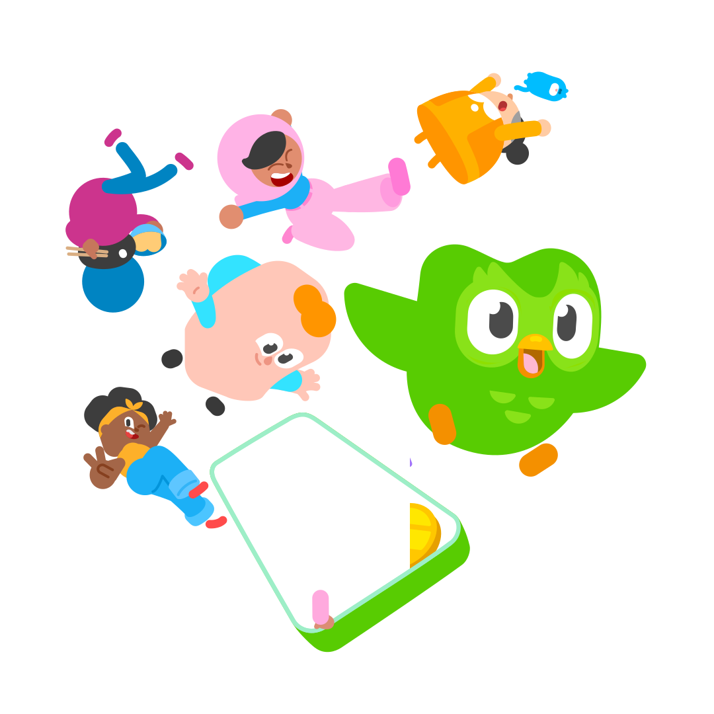

<p align="center">
  
</p>
<p align="center">
    <h1 align="center">DUOLINGO-CLONE</h1>
</p>
<p align="center">
	
	
	
</p>
<p align="center">
		<em>Built with the tools and technologies:</em>
</p>
<p align="center">
	
	
	
	
	
	<br>
	
	
	
	
</p>

<br>

##### 🔗 Table of Contents

- [📂 Repository Structure](#-repository-structure)
- [🚀 Getting Started](#-getting-started)
  - [📦 Installation](#-installation)
  - [🤖 Usage](#-usage)

## 📂 Repository Structure

```sh
└── Duolingo-Clone/
    ├── README.md
    ├── bun.lockb
    ├── eslint.config.js
    ├── index.html
    ├── main.js
    ├── package.json
    ├── postcss.config.js
    ├── public
    │   └── vite.svg
    ├── src
    │   ├── App.tsx
    │   ├── assets
    │   │   ├── fonts
    │   │   │   ├── din-round-bold.woff2
    │   │   │   └── din-round-light.woff2
    │   │   ├── images
    │   │   │   └── header.png
    │   │   └── svg
    │   │       ├── clock.svg
    │   │       ├── duolingo.svg
    │   │       ├── error.svg
    │   │       ├── flags.svg
    │   │       ├── google-logo.svg
    │   │       ├── note.svg
    │   │       └── welcome.svg
    │   ├── common
    │   │   └── types
    │   │       ├── AuthContext.types.ts
    │   │       ├── Card.types.ts
    │   │       ├── ErrorBoundary.types.ts
    │   │       ├── Flag.types.ts
    │   │       ├── Footer.types.ts
    │   │       ├── Language.types.ts
    │   │       ├── LeftBar.types.ts
    │   │       ├── Login.types.ts
    │   │       ├── Section.types.ts
    │   │       ├── TopBar.types.ts
    │   │       └── welcome.types.ts
    │   ├── components
    │   │   ├── Card.tsx
    │   │   ├── ErrorBoundary.tsx
    │   │   ├── ErrorMessage.tsx
    │   │   ├── Flag.tsx
    │   │   ├── Footer.tsx
    │   │   ├── LanguageCarousel.tsx
    │   │   ├── LanguageDropDown.tsx
    │   │   ├── LeftBar.tsx
    │   │   ├── Loader
    │   │   │   ├── Loader.tsx
    │   │   │   └── loader.css
    │   │   ├── NavBar.tsx
    │   │   ├── RightBar.tsx
    │   │   ├── Section.tsx
    │   │   └── TopBar.tsx
    │   ├── contexts
    │   │   └── AuthContext.tsx
    │   ├── hooks
    │   │   ├── useAuth.ts
    │   │   ├── useFetchQuestions.ts
    │   │   ├── useLogin.ts
    │   │   └── useRegister.ts
    │   ├── index.css
    │   ├── main.tsx
    │   ├── mocks
    │   │   └── db.json
    │   ├── pages
    │   │   ├── Character.tsx
    │   │   ├── Landing.tsx
    │   │   ├── LangRegister.tsx
    │   │   ├── Leaderboards.tsx
    │   │   ├── Learn
    │   │   │   ├── Learn.tsx
    │   │   │   └── learn.css
    │   │   ├── Login.tsx
    │   │   ├── Quests.tsx
    │   │   ├── Register.tsx
    │   │   ├── Shop.tsx
    │   │   └── Welcome.tsx
    │   ├── utils
    │   │   ├── englishCharData.ts
    │   │   └── languages.ts
    │   └── vite-env.d.ts
    ├── tailwind.config.js
    ├── tsconfig.app.json
    ├── tsconfig.json
    ├── tsconfig.node.json
    └── vite.config.ts
```

---

## 🚀 Getting Started

### 📦 Installation

Build the project from source:

1. Clone the Duolingo-Clone repository:

```sh
❯ git clone https://github.com/neeraj779/Duolingo-Clone
```

2. Navigate to the project directory:

```sh
❯ cd Duolingo-Clone
```

3. Install the required dependencies:

```sh
❯ npm install
```

### 🤖 Usage

To run the project, execute the following command:

```sh
❯ npm run dev
```
